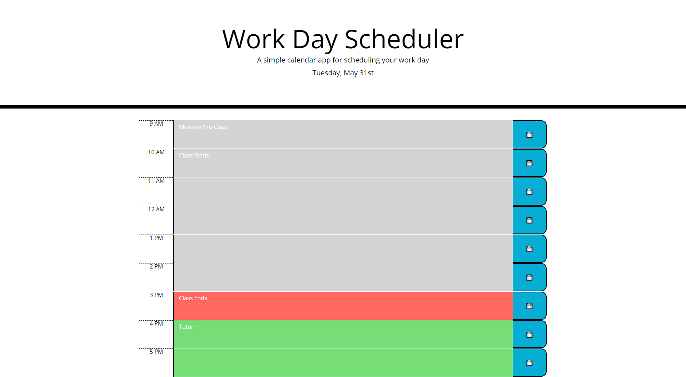

# Work Schedule

## Table of Contents

1. [Description](#description)
2. [Usage](#usage)
3. [Visuals](#visuals)
4. [Resources](#resources)

## Description

Edited existing code to create a working day planner utilizing jQuery and the Moment.js library.

Features include:

- Today's date displayed at the top
- Input text areas that save to local storage based on the time slot and display when refreshed
- Color-coded time blocks based on the current time. Past times will be colored gray, the present block will be red, and the future blocks will be green.

## Usage

When the page is loaded or refreshed, the current date will display as well as anything saved in the text areas below. Typing in a new task for a time block will save over the old task and display the new. As the page is refreshed, the time blocks will display saved text and change color based on past (gray), present (red), and future (green).

## Visuals

This is an example screenshot of the page with a few slots saved and the colors updated based on the current time.

## Resources

- [Live Site](https://kleylakb89.github.io/05-work-schedule/)
- [Repository](https://github.com/kleylakb89/05-work-schedule)